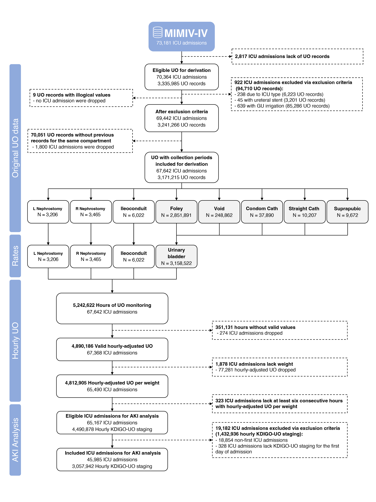

<!-- ################################ NOTICE ################################### -->
<!-- # 1. Running and creating the hourly-adjusted UO and AKI tables in the    # -->
<!-- #    associated billing account/project name is a preliminary requirement.# -->
<!-- #    For more information and instruction see the GitHub repository.      # -->
<!-- #                                                                         # -->
<!-- # 2. Please use 'Knit with Parameters' to provide your billing account    # -->
<!-- #    for Google's BigQuery that is credentialed for PhysioNet/MIMIC-IV.   # -->
<!-- ########################################################################### -->

```{r setup, include=FALSE}
knitr::opts_chunk$set(warning = FALSE, message = FALSE) 

# Installs pacman ("package manager") if needed
if (!require("pacman")) install.packages("pacman")

# Use pacman to load add-on packages as desired
pacman::p_load(pacman, DBI, bigrquery, tidyverse, reshape2, finalfit, psych,
               ggplot2, ggbreak,scales,ggpmisc, ggforce, rlang, quantreg,
               broom, kableExtra, rmdformats, survival, survminer, nortest,
               gtsummary, ggsci, ggsurvfit, gt)

# Establish connection with BigQuery and billing acount with the correct access
con <- dbConnect(
  bigrquery::bigquery(),
  project = "physionet-data",
  dataset = "mimiciv_icu",
  billing = params$billing_account
)

dbListTables(con)
```

```{r Quering BigQuery, cache=TRUE, include=FALSE}
raw_uo <- dbGetQuery(con, "SELECT * FROM `mimic_uo_and_aki.a_urine_output_raw`")

raw_uo_eligible <- dbGetQuery(con, statement = read_file('sql/raw eligible.sql'))

raw_uo_excluions_duplicates <- dbGetQuery(con, statement = read_file('sql/raw_uo_excluions_duplicates.sql'))

uo_rate_including_null_collection_period <- dbGetQuery(con, "SELECT * FROM `mimic_uo_and_aki.b_uo_rate`")
uo_rate <- uo_rate_including_null_collection_period %>%
  drop_na(TIME_INTERVAL)
uo_rate_true <- uo_rate %>% filter(VALIDITY == TRUE)
uo_rate_true_foley <- uo_rate_true %>% filter(SOURCE == "Foley")

hourly_uo <- dbGetQuery(con, "SELECT * FROM `mimic_uo_and_aki.c_hourly_uo`")
uo_ml_kg_hr <- hourly_uo %>% 
  drop_na(HOURLY_VALID_WEIGHTED_MEAN_RATE, WEIGHT_ADMIT) %>%
  mutate(ML_KG_HR = HOURLY_VALID_WEIGHTED_MEAN_RATE / WEIGHT_ADMIT)

kdigo_uo_stage <-
  dbGetQuery(con,
             "SELECT * FROM `mimic_uo_and_aki.d3_kdigo_stages` WHERE aki_stage_uo IS NOT NULL")

table_1 <- dbGetQuery(con, statement = read_file('sql/tbl1.sql'))

tbl1_aki <- dbGetQuery(con, statement = read_file('sql/tbl1 aki.sql'))

akis <- dbGetQuery(con, statement = read_file('sql/akis with mortality.sql'))

aki_epi <- dbGetQuery(con, statement = read_file('sql/aki epi.sql'))

creat_diff <- dbGetQuery(con, statement = read_file('sql/creat diff.sql'))

icus_with_valid_kdigo_uo <- dbGetQuery(con, statement = read_file('sql/icus with valid kdigo uo.sql'))

anchor_year <- dbGetQuery(con, statement = read_file('sql/anchor year.sql'))
```
\ 

This is a full reproduction for the results of the derivation cohort (MIMICdb).

\ 

**For more details see:**

-   Full article at Scientific Data: [DOI:]()
-   [GitHub repository](https://github.com/arielhasidim/mimic-uo-and-aki)

### Citation

.............

.............

------------------------------------------------------------------------

# Population and Study's Sample

**Total ICU stays in mimic:**
```{r}
dbGetQuery(con, "SELECT count(*) FROM `physionet-data.mimiciv_icu.icustays`")
```

\ 

**ICU stays with UO records (eligible):**

```{r}
n_distinct(raw_uo$STAY_ID)
```

\

**Hospital admissions with UO records:**

```{r}
n_distinct(raw_uo$HADM_ID)
```

\ 

**Patients with UO records:**

```{r}
n_distinct(raw_uo$SUBJECT_ID)
```

\ 

**Count all UO records (before exclusions):**

```{r}
all_rows_count <- nrow(raw_uo)
all_rows_count
```

\ 

## Figure for Raw UO Records Data
Frequency of urine output charting by source
```{r}
S3a <- raw_uo %>% 
  mutate(
    LABEL = case_when(
      LABEL == "GU Irrigant/Urine Volume Out" ~ "GU Irrig. Out",
      LABEL == "GU Irrigant Volume In" ~ "GU Irrig. In",
      .default = LABEL
    )
  ) %>% count(LABEL, sort = TRUE) %>%
   ggplot(aes(x=reorder(LABEL, -n), y=n)) +
   geom_bar(stat="identity") +
   xlab("") +
   ylab("") +
   geom_bar(stat="identity", fill="steelblue") +
   geom_text(aes(label=n), vjust=-0.6, color="black", size=3) +
   theme_classic() +
   theme(axis.text.y=element_blank()) +
   theme(axis.text.x = element_text(angle = 45, hjust = 1)) +
       theme(
         plot.title = element_text(color = "#0099F8", size = 16, face = "bold"),
         plot.subtitle = element_text(size = 10, face = "bold"),
         plot.caption = element_text(face = "italic")
       )

S3a
```

\ 

## Temporal Trends Analysis

The MIMIC-IV dataset is a collection of data collected between 2005 and 2022. Each patient in the dataset has an "anchor year" that is organized into Three-year periods.

**Frequency of urine output charting by year:**

For each hospital admission, we adjust the beginning of the anchor year based on the years elapsed since the patient's first hospital admission. 

```{r}
S4_b <- raw_uo %>%
  left_join(anchor_year, by = "HADM_ID") %>%
  count(ANCHOR_START, sort = TRUE) %>%
   ggplot(aes(x=as_factor(ANCHOR_START), y=n)) +
   geom_bar(stat="identity") +
   xlab("Anchor Year Starts") +
   ylab("") +
   geom_bar(stat="identity", fill="steelblue") +
   geom_text(aes(label=n), vjust=-0.6, color="black", size=3) +
   theme_classic() +
   theme(axis.text.y=element_blank()) +
   theme(axis.text.x = element_text(angle = 45, hjust = 1)) +
       theme(
         plot.title = element_text(color = "#0099F8", size = 16, face = "bold"),
         plot.subtitle = element_text(size = 10, face = "bold"),
         plot.caption = element_text(face = "italic")
       )

S4_b
```

**Regrouping:**

```{r}
anchor_year_regrouped <- anchor_year %>%
  mutate(ANCHOR_GROUP = case_when(ANCHOR_START < 2011 ~ "2008-2010",
                                       ANCHOR_START >= 2011 & ANCHOR_START < 2014 ~ "2011-2013",
                                       ANCHOR_START >= 2014 & ANCHOR_START < 2017 ~ "2014-2016",
                                       .default = "2017+"))
```

**Frequency of urine output charting by year:**

```{r}
positions <- c("2008-2010", "2011-2013", "2014-2016", "2017+")

S4_c <- raw_uo %>%
  left_join(anchor_year_regrouped, by = "HADM_ID") %>%
  count(ANCHOR_GROUP, sort = TRUE) %>%
   ggplot(aes(x=as_factor(ANCHOR_GROUP), y=n)) +
   scale_x_discrete(limits = positions) +
   geom_bar(stat="identity") +
   xlab("Grouped Anchor years") +
   ylab("") +
   geom_bar(stat="identity", fill="steelblue") +
   geom_text(aes(label=n), vjust=-0.6, color="black", size=3) +
   theme_classic() +
   theme(axis.text.y=element_blank()) +
   theme(axis.text.x = element_text(angle = 45, hjust = 1)) +
       theme(
         plot.title = element_text(color = "#0099F8", size = 16, face = "bold"),
         plot.subtitle = element_text(size = 10, face = "bold"),
         plot.caption = element_text(face = "italic")
       )

S4_c
```

**Frequency of urine output charting by source:**

```{r}
positions <- c("2008-2010", "2011-2013", "2014-2016", "2017+")

S4_d <- raw_uo %>%
  left_join(anchor_year_regrouped, by = "HADM_ID") %>%
  mutate(
    LABEL = case_when(
      LABEL == "GU Irrigant/Urine Volume Out" ~ "GU Irrig. Out",
      LABEL == "GU Irrigant Volume In" ~ "GU Irrig. In",
      .default = LABEL
    )
  ) %>%
  group_by(ANCHOR_GROUP) %>%
  count(LABEL, sort = TRUE) %>%
  ggplot(aes(
    fill = LABEL,
    y = n,
    x = as_factor(ANCHOR_GROUP)
  )) +
  scale_x_discrete(limits = positions) +
  geom_bar(position = "fill", stat = "identity") +
  xlab("Grouped Anchor years") +
  ylab("Proportions") +
  scale_fill_discrete(name = "Source") +
  theme_classic() +
  theme(axis.text.x = element_text(angle = 45, hjust = 1))

S4_d
```

**Mean urine output volume by source:**

```{r}
S4_e <- uo_rate_including_null_collection_period %>%
  left_join(anchor_year_regrouped, by = "HADM_ID") %>%
  group_by(ANCHOR_GROUP, SOURCE) %>%
  summarize(Mean = mean(VALUE, na.rm = TRUE)) %>%
  ggplot(aes(
    fill = as_factor(ANCHOR_GROUP),
    y = Mean,
    x = SOURCE
  )) +
  geom_bar(position = "dodge", stat = "identity") +
  xlab("Source") +
  ylab("mL") +
  scale_fill_discrete(name = "Grouped Anchor years") +
  theme_classic() +
  theme(axis.text.x = element_text(angle = 45, hjust = 1))

S4_e
```

**Mean collection time by source:**

```{r}
S4_f <- uo_rate %>%
  left_join(anchor_year_regrouped, by = "HADM_ID") %>%
  group_by(ANCHOR_GROUP, SOURCE) %>%
  summarize(Mean = mean(TIME_INTERVAL, na.rm=TRUE)) %>%
  ggplot(aes(fill=as_factor(ANCHOR_GROUP), y=Mean / 60, x=SOURCE)) + 
    geom_bar(position="dodge", stat="identity") +
  xlab("Source") +
  ylab("Hr") +
  scale_fill_discrete(name = "Anchor Year Starts") +
  theme_classic() +
  theme(axis.text.x = element_text(angle = 45, hjust = 1))

S4_f
```

\ 

## Duplication Analysis

### Check for Distinctiveness

First, we are basing distinctive rows in the raw UO data.

**Count distinct raw rows:**

```{r}
distinct_time_item_patient_rows_count <- raw_uo %>% 
  select(-VALUE, 
         -SERVICE, 
         -LABEL) %>% 
  n_distinct()

distinct_time_item_patient_rows_count
```

Conclusion: the original raw query does not have duplicates (all rows are distinct by all columns)

\ 

### Check for Simultaneous Charting

```{r}
raw_uo_excluions_duplicates$same_value <- as.factor(raw_uo_excluions_duplicates$same_value)
raw_uo_excluions_duplicates$label <- as.factor(raw_uo_excluions_duplicates$label)
raw_uo_excluions_duplicates$label <- factor(raw_uo_excluions_duplicates$label, levels = as.factor(names(sort(table(raw_uo_excluions_duplicates$label),
                                  decreasing = TRUE))))

S4_a <- raw_uo_excluions_duplicates %>%
  select(same_value, label) %>%
  tbl_summary(by = same_value)

S4_a
```

|       Show full SQL query -----\>

```{sql, class.source = 'fold-hide', eval=FALSE, code = readLines("sql/raw_uo_excluions_duplicates.sql")}
```

In conclusion, most of the records have different values, and thus human error in duplicate record-keeping is not likely.

\ 

## Exclusion

Used for *Figure 2. Overview of study's process.*

**ICU type exclusion:**

```{r}
dbGetQuery(con, statement = read_file('sql/service_type_exclusion.sql'))
```

|       Show full SQL query -----\>

```{sql, class.source = 'fold-hide', eval=FALSE, code = readLines("sql/service_type_exclusion.sql")}
```

\ 

**Uretral stent exclusion:**

```{r}
dbGetQuery(con, statement = read_file('sql/ure_stent_exclusion.sql'))
```

|       Show full SQL query -----\>

```{sql, class.source = 'fold-hide', eval=FALSE, code = readLines("sql/ure_stent_exclusion.sql")}
```

\ 

**GU irrigation exclusion:**

```{r}
dbGetQuery(con, statement = read_file('sql/gu_irig_exclusion.sql'))
```

|       Show full SQL query -----\>

```{sql, class.source = 'fold-hide', eval=FALSE, code = readLines("sql/gu_irig_exclusion.sql")}
```

\ 

**Not passing sanity check:**

```{r}
dbGetQuery(con, statement = read_file('sql/sanity.sql'))
```

|       Show full SQL query -----\>

```{sql, class.source = 'fold-hide', eval=FALSE, code = readLines("sql/sanity.sql")}
```

\ 

**Total raw urine output after exclusion ("included records, before dropping records without collection times"):**

```{r}
nrow(raw_uo_eligible)
```

|       Show full SQL query -----\>

```{sql, class.source = 'fold-hide', eval=FALSE, code = readLines("sql/raw eligible.sql")}
```

\ 

**Total icu stays after exclusion ("included records, before dropping records without collection times"):**

```{r}
n_distinct(raw_uo_eligible$STAY_ID)
```

\ 

**Exclusion of first volume in each compartment per ICU stay:**

```{r}
uo_rate_including_null_collection_period %>%
  filter(STAY_ID %in% raw_uo_eligible$STAY_ID) %>%
  filter(is.na(TIME_INTERVAL)) %>%
  nrow()
```

\ 

**UO records with time intervals ("Included records"):**

```{r}
uo_rate_including_null_collection_period %>%
  filter(STAY_ID %in% raw_uo_eligible$STAY_ID) %>%
  drop_na(TIME_INTERVAL) %>%
  nrow()
```

\ 

**Count UO records by anatomical compartment:**

```{r}
uo_rate %>% 
  mutate(agg_group = case_when(SOURCE == "Foley" |
                                 SOURCE == "Condom Cath" |
                                 SOURCE == "Straight Cath" |
                                 SOURCE == "Suprapubic" |
                                 SOURCE == "Void" ~ "Urinary bladder",
                               TRUE ~ SOURCE)
  ) %>%
           group_by(agg_group) %>%
   dplyr::summarise(N = n()
  )
```

\ 

**ICU stays with UO records with time intervals:**

```{r}
print("ICU stays after exclusion criteria:")
uo_rate_including_null_collection_period %>%
  {n_distinct(.$STAY_ID)}

print("Included ICU stays (has time intervals):")
uo_rate_including_null_collection_period %>%
                     drop_na(TIME_INTERVAL) %>%
  {n_distinct(.$STAY_ID)}

print("ICU stays with UO records that does not  have time interval (no previous UO record in the same compartment:")
uo_rate_including_null_collection_period %>%
                     filter(is.na(TIME_INTERVAL)) %>%
  {n_distinct(.$STAY_ID)}

print("ICU stays dropped due to no UO records with time intervalst (no previous UO record in the same compartment:")
(uo_rate_including_null_collection_period %>%
                     filter(is.na(TIME_INTERVAL))) %>%
  filter(!(STAY_ID %in% (uo_rate_including_null_collection_period %>%
                     drop_na(TIME_INTERVAL))$STAY_ID)) %>%
  {n_distinct(.$STAY_ID)}
```

\

**Count total ICU days of UO monitoring for icu stays with time intervals:**

```{r}
hourly_uo %>%
  filter(STAY_ID %in%
           (uo_rate_including_null_collection_period %>%
                     drop_na(TIME_INTERVAL))$STAY_ID) %>%
  nrow() / 24
```

\ 

**Hours of UO monitoring:**

```{r}
print("Hours of UO monitoring in all included ICU stays:")
hourly_uo %>%
  filter(STAY_ID %in%
           (
             uo_rate_including_null_collection_period %>%
               drop_na(TIME_INTERVAL)
           )$STAY_ID) %>%
  nrow()

print("Valid hourly-adjusted UO monitoring hours:")
hourly_uo %>%
  filter(STAY_ID %in%
           (
             uo_rate_including_null_collection_period %>%
               drop_na(TIME_INTERVAL)
           )$STAY_ID) %>%
  drop_na(HOURLY_VALID_WEIGHTED_MEAN_RATE) %>%
  nrow()

print("ICU stays with valid hourly-adjusted UO monitoring hours:")
hourly_uo %>%
  filter(STAY_ID %in%
           (
             uo_rate_including_null_collection_period %>%
               drop_na(TIME_INTERVAL)
           )$STAY_ID) %>%
  drop_na(HOURLY_VALID_WEIGHTED_MEAN_RATE) %>%
  {n_distinct(.$STAY_ID)}
```

\


**Proportion of valid hours covered out of included hours of uo monitoring:**

```{r}
hourly_uo %>%
  filter(STAY_ID %in%
           (
             uo_rate_including_null_collection_period %>%
               drop_na(TIME_INTERVAL)
           )$STAY_ID) %>%
  drop_na(HOURLY_VALID_WEIGHTED_MEAN_RATE) %>%
  nrow() /
hourly_uo %>%
  filter(STAY_ID %in%
           (
             uo_rate_including_null_collection_period %>%
               drop_na(TIME_INTERVAL)
           )$STAY_ID) %>%
  nrow()
```

\ 

**Hourly-adjusted UO with admission weights:**

```{r}
print("ICU stays with admission weight and valid hourly-adjusted UO:")
hourly_uo %>%
  filter(STAY_ID %in%
           (
             uo_rate_including_null_collection_period %>%
               drop_na(TIME_INTERVAL)
           )$STAY_ID) %>%
  drop_na(HOURLY_VALID_WEIGHTED_MEAN_RATE, WEIGHT_ADMIT) %>%
  {n_distinct(.$STAY_ID)}

print("Valid hourly-adjusted UO monitoring hours with admission weights:")
hourly_uo %>%
  filter(STAY_ID %in%
           (
             uo_rate_including_null_collection_period %>%
               drop_na(TIME_INTERVAL)
           )$STAY_ID) %>%
  drop_na(HOURLY_VALID_WEIGHTED_MEAN_RATE, WEIGHT_ADMIT) %>%
  nrow()
```

\

**ICU stays with calculated KDIGO-UO staging (at least six consecutive hours with valid charting of hourly-adjusted UO)**

```{r}
print("number of ICU stays with valid KDIGO-UO staging")
kdigo_uo_stage %>% 
  filter(stay_id %in%
           (
             uo_rate_including_null_collection_period %>%
               drop_na(TIME_INTERVAL)
           )$STAY_ID) %>%
  {n_distinct(.$stay_id)}

print("number of included hours with valid KDIGO-UO staging")
kdigo_uo_stage %>% 
  filter(stay_id %in%
           (
             uo_rate_including_null_collection_period %>%
               drop_na(TIME_INTERVAL)
           )$STAY_ID) %>%
  nrow()
```

\

**eligible first ICU admission to each patient for AKI analysis**

```{r}
first_icu_stay <- dbGetQuery(con, "SELECT subject_id,
            ARRAY_AGG(
                STAY_ID
                ORDER BY
                    intime ASC
                LIMIT
                    1
            ) [OFFSET(0)] FIRST_STAY_ID_IN_PATIENT
        FROM
            `physionet-data.mimiciv_icu.icustays`
        GROUP BY
            subject_id")

print("number of first ICU stays with valid KDIGO-UO staging")
kdigo_uo_stage %>% 
  filter(stay_id %in% first_icu_stay$FIRST_STAY_ID_IN_PATIENT
         & stay_id %in% raw_uo_eligible$STAY_ID) %>%
  {n_distinct(.$stay_id)}

print("number of valid hourly KDIGO-UO staging in first ICU stays")
kdigo_uo_stage %>% 
  filter(stay_id %in% first_icu_stay$FIRST_STAY_ID_IN_PATIENT
         & stay_id %in% raw_uo_eligible$STAY_ID) %>%
  nrow()
```

**included ICU admissions for AKI analysis**

```{r}
print("number of first ICU stays (after exclusion criteria) with valid KDIGO-UO staging for the first 24-hours ins ICU stay")
kdigo_uo_stage %>% 
  filter(stay_id %in% aki_epi$STAY_ID) %>%
  {n_distinct(.$stay_id)}

print("number of valid hourly KDIGO-UO for those stays")
kdigo_uo_stage %>% 
  filter(stay_id %in% aki_epi$STAY_ID) %>%
  nrow()
```

## Inclusion/Exclusion Flowchart 

```{r}

```

## Table 1 - Patient's characteristics

```{r}
table_1$SERVICE <- as.factor(table_1$SERVICE)
table_1$admission_age <- as.numeric(table_1$admission_age)
table_1$weight_admit <- as.numeric(table_1$weight_admit)
table_1$height_first <- as.numeric(table_1$height_first)
table_1$creat_first <- as.numeric(table_1$creat_first)

table_1 <- table_1 %>%
  mutate(
    race =
      case_when(
        grepl("asian", race, ignore.case = TRUE) ~ "Asian",
        grepl("black", race, ignore.case = TRUE) ~ "African American",
        grepl("white", race, ignore.case = TRUE) ~ "Caucasian",
        grepl("hispanic", race, ignore.case = TRUE) ~ "Hispanic",
        grepl("other", race, ignore.case = TRUE) ~ "Other",
        grepl("native", race, ignore.case = TRUE) ~ "Other",
        grepl("MULTIPLE", race, ignore.case = TRUE) ~ "Other",
        grepl("PORTUGUESE", race, ignore.case = TRUE) ~ "Other",
        grepl("SOUTH AMERICAN", race, ignore.case = TRUE) ~ "Other",
        TRUE ~ as.character(NA)
      )
  )

uo_for_table1 <- uo_rate_including_null_collection_period %>%
  drop_na(TIME_INTERVAL) %>%
  group_by(STAY_ID) %>%
  summarise(
    count = n(),
    volumes = mean(VALUE, na.rm = TRUE),
    collection_times = mean(TIME_INTERVAL, na.rm = TRUE),
    rates = mean(HOURLY_RATE, na.rm = TRUE),
    validity = mean(if_else(VALIDITY == TRUE, 1, 0)),
    ml_kg_hr = mean(HOURLY_RATE / WEIGHT_ADMIT, na.rm = TRUE)
  )

t1a <- table_1 %>%
  select(
    admission_age,
    weight_admit,
    gender,
    race,
    sofa_first_day,
    charlson_comorbidity_index,
    ckd,
    creat_first,
  # scr_baseline,
    hospital_days,
    icu_days,
    rrt_binary,
    hospital_expire_flag
  ) %>%
  tbl_summary(
    type = list(
      c(hospital_expire_flag,
        ckd,
        rrt_binary) ~ "dichotomous",
      c(admission_age,
        weight_admit,
        creat_first) ~ "continuous"
    ),
    statistic = c(admission_age,
                  weight_admit,
                  creat_first) ~ "{mean} ({sd})",
    missing = "no",
    label = list(
      admission_age ~ "Age at Hospital Admission, years",
      gender ~ "Gender",
      weight_admit ~ "Weight at ICU Admission, kg",
      charlson_comorbidity_index ~ "CCI Score",
      sofa_first_day ~ "SOFA Score at ICU Admission",
      ckd ~ "CKD, Stage 1-4",
      creat_first ~ "First Creatinine, mg/dL",
      race ~ "Ethnicity",
      icu_days ~ "Time in ICU, days",
      hospital_days ~ "Time in hospital, days",
      rrt_binary ~ "Renal replacement therapy",
      hospital_expire_flag ~ "Mortality"
    )
  ) %>%
  add_n() 

display_prec <- function(x)
  mean(x) * 100

t1b <- uo_for_table1 %>%
  select(count,
         volumes,
         validity,
         collection_times,
         rates,
         ml_kg_hr) %>%
  tbl_summary(
    type = list(
      c(volumes,
        collection_times,
        rates,
        ml_kg_hr,
        validity) ~ "continuous"
    ),
    statistic = list(
      c(volumes,
        collection_times,
        rates,
        ml_kg_hr) ~ "{mean} ({sd})",
      validity ~ "{display_prec}%"
    ),
    digits = list(validity ~ 0),
    missing = "no",
    label = list(
      count ~ "Number of Measurements",
      volumes ~ "Average Volumes, mL",
      collection_times ~ "Average Collection Times, minutes",
      validity ~ "Proportion of Valid Records, mean",
      rates ~ "Average Rates, mL/hr",
      ml_kg_hr ~ "Average Rate to Weight, mL/hr/kg"
    )
  ) %>%
  add_n() 

t1c <- tbl1_aki %>%
  select(aki_binary,
         aki_count,
         max_stage,
         aki_portion,
         aki_mean_duration,
         aki_total_time
         ) %>%
  tbl_summary(
    type = list(c(aki_mean_duration,
                  aki_total_time) ~ "continuous"),
    statistic =
      list(
        c(aki_mean_duration,
          aki_total_time) ~ "{mean} ({sd})",
        aki_portion ~ "{display_prec}%"
      ),
    digits = list(aki_portion ~ 0),
    label = list(
      aki_binary ~ "ICU stays with AKI",
      aki_count ~ "Number of AKIs in ICU Stay",
      max_stage ~ "Maximal KDIGO-UO Stage",
      aki_mean_duration ~ "Average AKI Duration, hours",
      aki_total_time ~ "Total Time in AKI, days",
      aki_portion ~ "Proportion of time in AKI, mean"
    ),
    missing = "no"
  ) %>%
  add_n() 

tbl_stack(
  list(t1a, t1b, t1c),
  group_header = c("ICU Stay", "UO Charting Across ICU Stay", "AKI across ICU Stay")
) %>%
  as_gt() %>%
  tab_source_note(source_note = "The variables age at hospital admission, gender, CCI, CKD, ethnicity, time in hospital, and mortality are measured for each hospital admission and might be counted for more than one ICU stay. All other variables are measured individually for each ICU stay. The variables average collection times, average rates, and average rate to weight are only presented for ICU stays with at least two UO measurements for the same compartment, and the latter also required weight at admission. AKI variables were presented for ICU stays with at least one hour with a non-null KDIGO-UO stage. The variables average AKI duration and total time in AKI were specifically reported for ICU stays with at least one AKI event.") %>%
  tab_source_note(source_note = "AKI: Acute Kidney Injury; CCI: Charlson Comorbidity Index; CKD Stage 1-4: Chronic Kidney Disease excluding end-stage-renal-disease; ICU: Intensive Care Unit; KDIGO: Kidney Disease: Improving Global Outcomes; SOFA: Sequential Organ Failure Assessment; UO: Urine Output.")
```

\ 

## Table 2 - UO records characteristics

```{r}
uo_rate$SOURCE <- as.factor(uo_rate$SOURCE)
uo_rate$VALIDITY <- as.factor(uo_rate$VALIDITY)
uo_rate$SERVICE <- as.factor(uo_rate$SERVICE)

uo_rate %>%
  select(VALUE, TIME_INTERVAL, SOURCE, VALIDITY, SERVICE) %>%
  tbl_summary(by=SERVICE) %>%
  add_overall()
```

\ 

## Data for single patient example

The data that was used for single patient sample in table 1 and figure 6.

### Raw UO records:

```{r}
raw_uo_as_character <- raw_uo %>%
  filter(STAY_ID == 36871275)
raw_uo_as_character[] <- lapply(raw_uo_as_character, as.character)

S2_a <- raw_uo_as_character %>%
  select(-SUBJECT_ID, -HADM_ID, -STAY_ID, -SERVICE) %>%
  arrange(., CHARTTIME) %>%
  slice_head(n=15) %>%
  gt() %>%
  fmt_number(use_seps = TRUE, decimals = 0)

S2_a
```

\ 

### UO Rates
```{r}
uo_rate %>%
  filter(STAY_ID == 36871275) %>%
  select(-HADM_ID, -STAY_ID, -WEIGHT_ADMIT, -SERVICE) %>%
  arrange(., CHARTTIME) %>%
  slice_head(n=20) %>%
  gt() %>%
  fmt_number(use_seps = TRUE, decimals = 0)
```

\ 

### Hourly-Adjusted UO
```{r}
hourly_uo %>%
  filter(STAY_ID == 36871275) %>%
  select(-STAY_ID, -WEIGHT_ADMIT) %>%
  arrange(., T_PLUS) %>%
  slice_head(n=20) %>%
  gt() %>%
  fmt_number(use_seps = TRUE, decimals = 0)
```

------------------------------------------------------------------------

# Raw data analysis

## Collection Periods

```{r}
S6_a <- uo_rate %>% group_by(SOURCE) %>%
   dplyr::summarise(N = n(),
                   Mean = round(mean(TIME_INTERVAL),0),
                   SD = round(sd(TIME_INTERVAL),0),
                   '5th' = round(quantile(TIME_INTERVAL, 0.05),0),
                   '10th' = round(quantile(TIME_INTERVAL, 0.1),0),
                   '25th' = round(quantile(TIME_INTERVAL, 0.25),0),
                   '50th' = round(quantile(TIME_INTERVAL, 0.50),0),
                   '75th' = round(quantile(TIME_INTERVAL, 0.75),0),
                   '95th' = round(quantile(TIME_INTERVAL, 0.95),0),
                   Min = round(min(TIME_INTERVAL),0),
                   Max = round(max(TIME_INTERVAL),0)
  ) %>% 
  arrange(desc(N)) %>% 
  gt() %>%
  fmt_number(use_seps = TRUE, decimals = 0)

S6_a
```

Collection Periods:

```{r}
S6_b <- ggplot(data = uo_rate, aes(x = TIME_INTERVAL / 60)) +
  geom_histogram(binwidth = 1) +
  facet_wrap(~factor(SOURCE, levels=c('Foley', 'Suprapubic', 'Ileoconduit',
                         'Void', 'Condom Cath', 'Straight Cath',
                         'R Nephrostomy', 'L Nephrostomy')), scales = "free") +
  xlim(-1, 20) +
  labs(
          x = "Time interval (hr)",
          y = "Frequency"
        ) +
        theme(
          plot.title = element_text(color = "#0099F8", size = 16, face = "bold"),
          plot.subtitle = element_text(size = 10, face = "bold"),
          plot.caption = element_text(face = "italic")
        )

S6_b
```

\ 

## Volumes and Collection Periods

```{r}
S7_a <- uo_rate %>% group_by(SOURCE) %>%
  dplyr::summarise(N = n(),
                   Mean = round(mean(VALUE),0),
                   SD = round(sd(VALUE),0),
                   '5th' = round(quantile(VALUE, 0.05),0),
                   '10th' = round(quantile(VALUE, 0.1),0),
                   '25th' = round(quantile(VALUE, 0.25),0),
                   '50th' = round(quantile(VALUE, 0.50),0),
                   '75th' = round(quantile(VALUE, 0.75),0),
                   '95th' = round(quantile(VALUE, 0.95),0),
                   Min = round(min(VALUE),0),
                   Max = round(max(VALUE),0)
  ) %>% 
  arrange(desc(N)) %>% 
  gt() %>%
  fmt_number(use_seps = TRUE, decimals = 0)

S7_a
```

```{r}
S7_b <- ggplot(data = uo_rate, aes(x = VALUE)) +
  facet_wrap(~factor(SOURCE, levels=c('Foley', 'Suprapubic', 'Ileoconduit',
                         'Void', 'Condom Cath', 'Straight Cath',
                         'R Nephrostomy', 'L Nephrostomy')), scales = "free") +
  geom_histogram(binwidth = 50) +
  xlim(-25, 1100) +
  labs(
        # title = "Volumes",
        x = "Volume (ml)",
        y = "Frequency"
      ) +
      theme(
        plot.title = element_text(color = "#0099F8", size = 16, face = "bold"),
        plot.subtitle = element_text(size = 10, face = "bold"),
        plot.caption = element_text(face = "italic")
      )

S7_b
```

\ 

### Records of zero volume

**The proportion of zero value UO measurements:**

```{r}
uo_rate_count <- uo_rate %>% 
  count(SOURCE, sort = TRUE)

uo_rate_0_count <- uo_rate %>% 
  filter(VALUE == 0) %>% 
  count(SOURCE, sort = TRUE)

count_uo_zero_vs_all <- left_join(uo_rate_count, 
                                  uo_rate_0_count, by = "SOURCE") %>% 
  mutate(PROPORTION = n.y / n.x) %>%
  pivot_longer(cols = n.y:n.x, names_to = "type")
  
S7_c <- count_uo_zero_vs_all %>%
  ggplot(aes(x=reorder(SOURCE, -value), y=value, fill=type)) +
    geom_bar(position="fill", stat="identity") +
    xlab("") +
    ylab("") +
    scale_fill_brewer(palette="Paired") +  
    geom_text(aes(label=ifelse(type == "n.y", paste0((round(PROPORTION, 3) * 100), "%"), "")), 
          color="black", 
          size=3, 
          vjust=-1,
          position="fill") +
    theme_minimal() +
    theme(axis.text.y=element_blank()) +
    theme(legend.position="none") +
  theme(axis.text.y=element_blank()) +
  theme(axis.text.x = element_text(angle = 45, hjust = 1))+
     labs(
         # title = "Proportion of zero value raw output count",
       ) +
       theme(
         plot.title = element_text(color = "#0099F8", size = 16, face = "bold"),
         plot.subtitle = element_text(size = 10, face = "bold"),
         plot.caption = element_text(face = "italic")
       )
S7_c
```

```{r}
uo_rate_0 <- uo_rate %>% filter(VALUE == 0) 
S7_d <- uo_rate_0 %>% group_by(SOURCE) %>%
  dplyr::summarise(N = n(),
                   Mean = round(mean(TIME_INTERVAL),0),
                   SD = round(sd(TIME_INTERVAL),0),
                   '5th' = round(quantile(TIME_INTERVAL, 0.05),0),
                   '10th' = round(quantile(TIME_INTERVAL, 0.1),0),
                   '25th' = round(quantile(TIME_INTERVAL, 0.25),0),
                   '50th' = round(quantile(TIME_INTERVAL, 0.50),0),
                   '75th' = round(quantile(TIME_INTERVAL, 0.75),0),
                   '95th' = round(quantile(TIME_INTERVAL, 0.95),0),
                   Min = round(min(TIME_INTERVAL),0),
                   Max = round(max(TIME_INTERVAL),0)
  ) %>% 
  arrange(desc(N)) %>% 
  gt() %>%
  fmt_number(use_seps = TRUE, decimals = 0)

S7_d
```

------------------------------------------------------------------------

# Adjusting for hourly UO

## UO Rate

```{r}
S8_a <- uo_rate %>% group_by(SOURCE) %>%
    dplyr::summarise(N = n(),
                   Mean = round(mean(HOURLY_RATE),0),
                   SD = round(sd(HOURLY_RATE),0),
                   '5th' = round(quantile(HOURLY_RATE, 0.05),0),
                   '10th' = round(quantile(HOURLY_RATE, 0.1),0),
                   '25th' = round(quantile(HOURLY_RATE, 0.25),0),
                   '50th' = round(quantile(HOURLY_RATE, 0.50),0),
                   '75th' = round(quantile(HOURLY_RATE, 0.75),0),
                   '95th' = round(quantile(HOURLY_RATE, 0.95),0),
                   Min = round(min(HOURLY_RATE),0),
                   Max = round(max(HOURLY_RATE),0)
  ) %>% 
  arrange(desc(N)) %>% 
  gt() %>%
  fmt_number(use_seps = TRUE, decimals = 0)

S8_a
```

```{r}
S8_b <- ggplot(data = uo_rate, aes(x = HOURLY_RATE)) +
  geom_histogram(binwidth = 20) +
  facet_wrap(~factor(SOURCE, levels=c('Foley', 'Suprapubic', 'Ileoconduit',
                         'Void', 'Condom Cath', 'Straight Cath',
                         'R Nephrostomy', 'L Nephrostomy')), scales = "free") +  xlim(-10, 500) +
  labs(
        # title = "UO Rates",
        # subtitle = "by source",
        x = "Rate (ml/hr)",
        y = "Frequency"
      ) +
      theme(
        plot.title = element_text(color = "#0099F8", size = 16, face = "bold"),
        plot.subtitle = element_text(size = 10, face = "bold"),
        plot.caption = element_text(face = "italic")
      )

S8_b
```

\ 

### Low UO Rate Analysis
The association between UO rates and collection periods, smoothed conditional means for records of Foley catheter.

```{r}
S8_d <- uo_rate %>%
  filter(SOURCE == "Foley",
         HOURLY_RATE < 500) %>%
  # slice_head(n = 50000) %>%
  ggplot(aes(x = HOURLY_RATE, y = TIME_INTERVAL)) +
  geom_smooth(se = TRUE, alpha = 0.1, linewidth = 1) +
  # geom_smooth(
  #   se = FALSE,
  #   method = "lm",
  #   linetype = "dashed",
  #   color = "red", 
  #   linewidth = 0.3
  # ) +
  geom_hline(yintercept = 60,
             size = 0.3,
             color = "#cccccc") +
  geom_vline(
    xintercept = 20,
    size = 0.3,
    color = "black",
    linetype = "dotdash"
  ) +
  scale_x_continuous(breaks = c(0, 20, 50, 100, 200, 300, 400, 500)) +
  scale_y_continuous(breaks = c(0, 60, 100, 200)) +
  coord_cartesian(xlim = c(0, 500), ylim = c(0, 200)) +
  labs(x = "Urine output rate (ml/hr)", y = "Collection periods (min)") +
  theme_classic() + # remove panel background and gridlines
  theme(
    plot.title = element_text(
      color = "#0099F8",
      size = 16,
      face = "bold"
    ),
    plot.subtitle = element_text(size = 10, face = "bold"),
    plot.caption = element_text(face = "italic")
  )

S8_d
```

Quantile analysis for collection periods as a function of rates.

```{r, cache=TRUE}
uo_rate_qreg <- uo_rate %>%
  left_join(anchor_year, by = "HADM_ID") %>%
  filter(SOURCE == "Foley",
         HOURLY_RATE < 500,
         ANCHOR_START > 2016) %>%
  slice_head(n = 500000)

#### Quantile
quantile_reg <- rq(TIME_INTERVAL ~
                     HOURLY_RATE,
                   seq(0.10, 0.90, by = 0.10),
                   # c(.05, .1, .25, .5, .75, .90, .95),
                   data = uo_rate_qreg)

# summary(quantile_reg, se = "iid") %>% 
#   plot()
```

```{r}
### OLS
lm <- lm(data=uo_rate_qreg,
         formula =  TIME_INTERVAL ~
           HOURLY_RATE)

ols <- as.data.frame(coef(lm))
ols.ci <- as.data.frame(confint(lm, level = 0.95))
ols2 <- cbind(ols, ols.ci)
ols2 <- tibble::rownames_to_column(ols2, var="term")


#### Quantile
S8_e <- quantile_reg %>%
  tidy(se.type = "iid", conf.int = TRUE, conf.level = 0.95) %>%
  filter(!grepl("factor", term)) %>%
  ggplot(aes(x=tau,y=estimate)) +
  theme_classic() +
  theme(
    strip.background = element_blank(),
    #strip.text.x = element_blank()
  ) +
  scale_y_continuous(limits = symmetric_limits) +
  scale_x_continuous(breaks = scales::pretty_breaks(n = 12)) +
  ##### quantilie results
  geom_point(color="#27408b", size = 0.3)+ 
  geom_line(color="black", linetype = "dotdash", size = 0.3)+ 
  geom_ribbon(aes(ymin=conf.low,ymax=conf.high),alpha=0.25, fill="#555555")+
  facet_wrap(~term, scales="free", ncol=1)+
  ##### OLS results
  geom_hline(data = ols2, aes(yintercept= `coef(lm)`), lty=1, color="red", size=0.3)+
  geom_hline(data = ols2, aes(yintercept= `2.5 %`), lty=2, color="red", size=0.3)+
  geom_hline(data = ols2, aes(yintercept= `97.5 %`), lty=2, color="red", size=0.3)+
  #### Lines
   geom_hline(yintercept = 0, size=0.3) 

S8_e
```


```{r}
# Visualization for Quantile Regression with some tau values: 
intercept_slope <- quantile_reg %>% 
  coef() %>% 
  t() %>% 
  data.frame() %>% 
  rename(intercept = X.Intercept., slope = HOURLY_RATE) %>% 
  mutate(quantile = row.names(.))


S8_f <-
  ggplot() +
  geom_jitter(data = uo_rate_qreg, aes(HOURLY_RATE, TIME_INTERVAL),
    alpha = 0.2,
    size = 0.5,
    stroke = 0.5,
    width = 2,
    height = 2
  ) +
  geom_abline(data = intercept_slope, aes(
    intercept = intercept,
    slope = slope,
    color = quantile
  ),
  linewidth=1) +
  theme_minimal() +
  labs(x = "Urine output rate (ml/hr)", y = "Collection periods (min)") +
  coord_cartesian(xlim = c(0, 500), ylim = c(0, 500))

S8_f
```

```{r, eval=FALSE}
uo_rate_qreg <- uo_rate %>%
  filter(SOURCE == "Foley") %>%
  arrange(STAY_ID) %>%
  slice_head(n = 500000)

percentile <- ecdf(uo_rate_qreg$TIME_INTERVAL)

#### Quantile
quantile_reg2 <- rq(TIME_INTERVAL ~ HOURLY_RATE, 
                    # seq(0.20, 0.80, by = 0.10), 
                    c(percentile(30),
                      percentile(60) - ((1-percentile(60))/10),
                      percentile(90),
                      percentile(120) - ((1-percentile(120))/10),
                      percentile(150),
                      percentile(180) - ((1-percentile(180))/10),
                      percentile(210),
                      percentile(240) - ((1-percentile(240))/10)),
                    data=uo_rate_qreg)

# Visualization for Quantile Regression with some tau values: 
intercept_slope <- quantile_reg2 %>% 
  coef() %>% 
  t() %>% 
  data.frame() %>% 
  rename(intercept = X.Intercept., slope = HOURLY_RATE) %>% 
  mutate(quantile = row.names(.))


ggplot() + 
  geom_point(data = uo_rate_qreg, aes(HOURLY_RATE, TIME_INTERVAL), 
             alpha = 0.5) + 
  geom_abline(data = intercept_slope, aes(intercept = intercept, slope = slope, color = quantile)) + 
  theme_minimal() + 
  labs(x = "HOURLY_RATE", y = "TIME_INTERVAL", 
       title = "Quantile Regression with tau = 0.25, 0.50 and 0.75", 
       caption = "Data Source: Koenker and Bassett (1982)") +
  coord_cartesian(xlim = c(0, 1000), ylim = c(0, 300))

```

\ 

**Collection periods for UO rate 20ml/hr or below**

```{r}
uo_rate %>% 
  filter(HOURLY_RATE <= 20) %>%
  group_by(SOURCE) %>%
   dplyr::summarise(N = n(),
                   Mean = round(mean(TIME_INTERVAL),0),
                   SD = round(sd(TIME_INTERVAL),0),
                   '5th' = round(quantile(TIME_INTERVAL, 0.05),0),
                   '10th' = round(quantile(TIME_INTERVAL, 0.1),0),
                   '25th' = round(quantile(TIME_INTERVAL, 0.25),0),
                   '50th' = round(quantile(TIME_INTERVAL, 0.50),0),
                   '75th' = round(quantile(TIME_INTERVAL, 0.75),0),
                   '95th' = round(quantile(TIME_INTERVAL, 0.95),0),
                   Min = round(min(TIME_INTERVAL),0),
                   Max = round(max(TIME_INTERVAL),0)
  ) %>% 
  arrange(desc(N)) %>% 
  gt() %>%
  fmt_number(use_seps = TRUE, decimals = 0)
```

```{r}
uo_rate %>% 
  filter(HOURLY_RATE <= 20) %>%
ggplot(aes(x = TIME_INTERVAL / 60)) +
  geom_histogram(binwidth = 1) +
  facet_wrap(~factor(SOURCE, levels=c('Foley', 'Suprapubic', 'Ileoconduit',
                         'Void', 'Condom Cath', 'Straight Cath',
                         'R Nephrostomy', 'L Nephrostomy')), scales = "free") +  xlim(-1, 20) +
  labs(
          title = "Collection periods for UO rate 20ml/hr or below",
          subtitle = "by source",
          x = "Time interval (hr)",
          y = "Frequency"
        ) +
        theme(
          plot.title = element_text(color = "#0099F8", size = 16, face = "bold"),
          plot.subtitle = element_text(size = 10, face = "bold"),
          plot.caption = element_text(face = "italic")
        )
```

\ 

### Mean Rate
**Mean UO rate weighted by tyme and grouped by source:**
```{r}
S8_c <- uo_rate_true %>% 
  group_by(SOURCE) %>%
  summarise(weighted_mean_rate = weighted.mean(HOURLY_RATE, TIME_INTERVAL)) %>%
  gt() %>%
  fmt_number(use_seps = TRUE, decimals = 1) %>%
  cols_label(
    SOURCE = "Source",
    weighted_mean_rate = "Weighted mean rate (ml/hr)"
  )

S8_c
```

\ 

## Hourly-adjusted UO

```{r}
S9_a <- hourly_uo %>% drop_na(HOURLY_VALID_WEIGHTED_MEAN_RATE) %>%
    dplyr::summarise(N = n(),
                   Mean = round(mean(HOURLY_VALID_WEIGHTED_MEAN_RATE),0),
                   SD = round(sd(HOURLY_VALID_WEIGHTED_MEAN_RATE),0),
                   '5th' = round(quantile(HOURLY_VALID_WEIGHTED_MEAN_RATE, 0.05),0),
                   '10th' = round(quantile(HOURLY_VALID_WEIGHTED_MEAN_RATE, 0.1),0),
                   '25th' = round(quantile(HOURLY_VALID_WEIGHTED_MEAN_RATE, 0.25),0),
                   '50th' = round(quantile(HOURLY_VALID_WEIGHTED_MEAN_RATE, 0.50),0),
                   '75th' = round(quantile(HOURLY_VALID_WEIGHTED_MEAN_RATE, 0.75),0),
                   '95th' = round(quantile(HOURLY_VALID_WEIGHTED_MEAN_RATE, 0.95),0),
                   Min = round(min(HOURLY_VALID_WEIGHTED_MEAN_RATE),0),
                   Max = round(max(HOURLY_VALID_WEIGHTED_MEAN_RATE),0)
  ) %>% 
  arrange(desc(N)) %>% 
  gt() %>%
  fmt_number(use_seps = TRUE, decimals = 0)

S9_a
```

```{r}
S9_b <- hourly_uo %>% drop_na(HOURLY_VALID_WEIGHTED_MEAN_RATE) %>%
ggplot(aes(x = HOURLY_VALID_WEIGHTED_MEAN_RATE)) +
  geom_histogram(binwidth = 25) +
  xlim(-10, 500) + 
  labs(
        # title = "Hourly-Adjusted UO",
        x = "Hourly UO (ml)",
        y = "Frequency"
      ) +
      theme(
        plot.title = element_text(color = "#0099F8", size = 16, face = "bold"),
        plot.subtitle = element_text(size = 10, face = "bold"),
        plot.caption = element_text(face = "italic")
      )

S9_b
```

\ 

### Simple Sum Comparison
**Showing proportion of hours with less than  100ml difference):**

```{r}
adj_uo_diff <- hourly_uo %>%
  select(HOURLY_VALID_WEIGHTED_MEAN_RATE, SIMPLE_SUM) %>%
  filter(!is.na(HOURLY_VALID_WEIGHTED_MEAN_RATE)) %>%
  mutate(hourly_diff = abs(HOURLY_VALID_WEIGHTED_MEAN_RATE - SIMPLE_SUM)) %>%
  mutate(
    cutoff_10 = if_else(hourly_diff < 10, 1, 0),
    cutoff_50 = if_else(hourly_diff < 50, 1, 0),
    cutoff_100 = if_else(hourly_diff < 100, 1, 0),
    cutoff_150 = if_else(hourly_diff < 150, 1, 0),
    cutoff_200 = if_else(hourly_diff < 200, 1, 0)
  )

my_order <- c("<10", "<50", "<100", "<150", "<200")

S11 <- adj_uo_diff %>%
  select(cutoff_10,
         cutoff_50,
         cutoff_100,
         cutoff_150,
         cutoff_200) %>%
  pivot_longer(cols = contains("cutoff")) %>%
  transmute(name = case_when(
    name == "cutoff_10" ~ "<10",
    name == "cutoff_50" ~ "<50",
    name == "cutoff_100" ~ "<100",
    name == "cutoff_150" ~ "<150",
    name == "cutoff_200" ~ "<200"
  ),
  value) %>%
  group_by(name) %>%
  summarise(agreement = paste0(round(mean(value) * 100, 1), "%"),
            non_agreement = paste0(round((1 - mean(
              value
            )) * 100, 1), "%")) %>%
  arrange(match(name, my_order)) %>%
  gt() %>%
  # tab_header(
  #   title = md("**Comparison of Hourly-Adjusted UO and Simple Summation**"),
  # ) %>%
  cols_label(
    name = "Cut-off (ml)",
    agreement = "Proportion  of Agreement",
    non_agreement = "Proportion  of Disagreement"
  ) %>%
  cols_align(
    align = "center"
  ) %>%
  tab_source_note(source_note = "The table demonstrates the significance of hourly adjustment for accuracy by presenting the variance between the adjusted values and the simple hourly summation. Cut-off values are based on the absolute difference between the hourly-adjusted UO and a simple hourly summation of UO. Measurements charted on the hour were included with the previous time interval. ")

adj_uo_diff <- hourly_uo %>%
  select(HOURLY_VALID_WEIGHTED_MEAN_RATE, SIMPLE_SUM) %>%
  filter(!is.na(HOURLY_VALID_WEIGHTED_MEAN_RATE)) %>%
  mutate(no_diff = 
           ifelse((is.na(HOURLY_VALID_WEIGHTED_MEAN_RATE) &
                  is.na(SIMPLE_SUM)) |
             (!is.na(HOURLY_VALID_WEIGHTED_MEAN_RATE) &
                  !is.na(SIMPLE_SUM) &
                    abs(HOURLY_VALID_WEIGHTED_MEAN_RATE-SIMPLE_SUM) < 100), 
                  1, 
                  0),
         .keep = "none")

S11

mean(adj_uo_diff$no_diff)
```

\ 

### Hourly UO Per Kilogram

```{r}
S9_c <- uo_ml_kg_hr %>%
  dplyr::summarise(N = n(),
                   Mean = round(mean(ML_KG_HR),2),
                   SD = round(sd(ML_KG_HR),2),
                   '5th' = round(quantile(ML_KG_HR, 0.05),2),
                   '10th' = round(quantile(ML_KG_HR, 0.1),2),
                   '25th' = round(quantile(ML_KG_HR, 0.25),2),
                   '50th' = round(quantile(ML_KG_HR, 0.50),2),
                   '75th' = round(quantile(ML_KG_HR, 0.75),2),
                   '95th' = round(quantile(ML_KG_HR, 0.95),2),
                   Min = round(min(ML_KG_HR),2),
                   Max = round(max(ML_KG_HR),2)
  ) %>% gt() %>%
  fmt_number(use_seps = TRUE, decimals = 2)

S9_c
```

```{r}
mean_log <- log(mean(uo_ml_kg_hr$ML_KG_HR))
sd_log <- log(sd(uo_ml_kg_hr$ML_KG_HR))
S9_d <- ggplot() + 
  xlim(-1, 10) + 
  geom_histogram(aes(x = ML_KG_HR
                     # , y =..density..
                     ), data=uo_ml_kg_hr, binwidth = 0.05) + 
  # stat_function(fun = dlnorm, args = list(meanlog = mean_log, sdlog = sd_log, log = FALSE), size=1, color='gray') +
  labs(
        # title = "Hourly-Adjusted UO per Kilogram",
        x = "Hourly volume to kg (ml/hr/kg)",
        y = "Frequency"
      ) +
      theme(
        plot.title = element_text(color = "#0099F8", size = 16, face = "bold"),
        plot.subtitle = element_text(size = 10, face = "bold"),
        plot.caption = element_text(face = "italic")
      )

S9_d

# save(all_rows_count, 
#      distinct_time_item_patient_rows_count, 
#      S2_a,
#      S3a,
#      S4_a, S4_b, S4_c, S4_d, S4_e, S4_f,
#      S6_a, S6_b,
#      S7_a, S7_b, S7_c, S7_d, 
#      S8_a, S8_b, S8_c, S8_d, S8_e, S8_f,
#      S9_a, S9_b, S9_c, S9_d, 
#      file = "s_data.Rda")
```

```{r}
mimic_uo_rate_true <- uo_rate_true
mimic_hourly_uo <- hourly_uo
mimic_raw_uo_eligible <- raw_uo_eligible

save(all_rows_count, 
     distinct_time_item_patient_rows_count, 
     S2_a,
     S3a,
     S4_a, S4_b, S4_c, S4_d, S4_e, S4_f,
     S6_a, S6_b,
     S7_a, S7_b, S7_c, S7_d, 
     S8_a, S8_b, S8_c, S8_d, S8_e, S8_f,
     S9_a, S9_b, S9_c, S9_d, 
     S11,
     mimic_uo_rate_true,
     mimic_hourly_uo,
     mimic_raw_uo_eligible,
     file = "s_data.Rda")
```

------------------------------------------------------------------------

# Performance analysis

describing the prevalnce of oliguric-AKI upon admission

```{r}
aki_epi %>%
  transmute(
    prevalnce_admit = first_kdigo_uo,
    Incidence_first_day = ifelse(first_kdigo_uo == 0, !is.na(max_uo_stage), NA),
    Incidence_first_day_with_stage = ifelse(first_kdigo_uo == 0 & max_uo_stage > 0, max_uo_stage, NA)
  ) %>%
  tbl_summary(
    missing = "no",
    label = list(
      prevalnce_admit ~ "Prevalence of oliguric-AKI at admission",
      Incidence_first_day ~ "Incidence of newly diagnosed AKI on the first day ",
      Incidence_first_day_with_stage ~ "Maximum KDIGO staging"
    )
  )
```

```{r}
akis_excluded <- aki_epi %>%
  filter(first_kdigo_uo == 0 & max_uo_stage > 0) %>%
  transmute(AKI_ID = first_aki_id) %>%
  left_join(akis, by = "AKI_ID")

akis_excluded$PEAK_UO_STAGE <- as.character(akis_excluded$PEAK_UO_STAGE)

aki_uo_analysis <- left_join(akis_excluded, uo_ml_kg_hr, by = "STAY_ID") %>%
  drop_na(AKI_START, 
          TIME_INTERVAL_FINISH, 
          PEAK_UO_STAGE) %>%
  select(AKI_ID,
         STAY_ID,
         PEAK_UO_STAGE,
         AKI_START,
         TIME_INTERVAL_FINISH,
         UO_KG = ML_KG_HR
         ) %>%
  mutate(TIME = as.double(difftime(TIME_INTERVAL_FINISH, 
                                   AKI_START, 
                                   units = c("hour")))) %>%
  filter(TIME >= -48 & TIME <= 48)

aki_creat_analysis <- left_join(akis_excluded, creat_diff %>% select(-STAY_ID), by = "HADM_ID") %>%
  select(AKI_ID,
         STAY_ID,
         PEAK_UO_STAGE,
         AKI_START,
         CHARTTIME,
         CREAT,
         SCR_BASELINE,
         CREAT_BASLINE_DIFF,
         CREAT_BASLINE_RATIO,
         CREAT_LOWEST7_DIFF,
         CREAT_LOWEST7_RATIO
         ) %>%
  mutate(AKI_TO_CREAT = as.double(difftime(CHARTTIME, 
                                   AKI_START, 
                                   units = c("mins"))) / 60) %>%
  filter(AKI_TO_CREAT >= -72 & AKI_TO_CREAT <= 72)
```

## First Oliguric-AKI Events
Number of identified first oliguric-AKI events in hospitalization stratified by maximum stage:

```{r}
akis_excluded %>%
  select(PEAK_UO_STAGE) %>%
  mutate(PEAK_UO_STAGE = as.factor(PEAK_UO_STAGE)) %>%
  tbl_summary()
```

table 1 for those ICU stays, stratified by max kdigo-uo stage:
```{r}
akis_excluded %>%
  select(STAY_ID, PEAK_UO_STAGE) %>%
  left_join(table_1, by = "STAY_ID") %>%
  select(
    PEAK_UO_STAGE,
    admission_age,
    weight_admit,
    gender,
    race,
    sofa_first_day,
    charlson_comorbidity_index,
    ckd,
    creat_first,
    # scr_baseline,
    hospital_days,
    icu_days,
    rrt_binary,
    hospital_expire_flag
  ) %>%
  tbl_summary(
    by = PEAK_UO_STAGE,
    type = list(
      c(hospital_expire_flag,
        ckd,
        rrt_binary) ~ "dichotomous",
      c(admission_age,
        weight_admit,
        creat_first,
        # scr_baseline
        ) ~ "continuous"
    ),
    statistic = c(admission_age,
                  weight_admit,
                  creat_first,
                  # scr_baseline
                  ) ~ "{mean} ({sd})",
    missing = "no",
    missing_text = "-",
    digits = list(hospital_days ~ c(1, 1)),
    label = list(
      admission_age ~ "Age at Hospital Admission, years",
      gender ~ "Gender",
      weight_admit ~ "Weight at ICU Admission, kg",
      charlson_comorbidity_index ~ "CCI Score",
      sofa_first_day ~ "SOFA Score at ICU Admission",
      ckd ~ "CKD, Stage 1-4",
      creat_first ~ "First ICU Creatinine, mg/dL",
      # scr_baseline ~ "Baseline Serum Creatinine, mg/dL",
      race ~ "Ethnicity",
      icu_days ~ "Time in ICU, days",
      hospital_days ~ "Time in hospital, days",
      rrt_binary ~ "Renal replacement therapy",
      hospital_expire_flag ~ "Mortality"
    ) 
  ) %>%
  add_p()
```

```{r}
mimic_uo_figure <- aki_uo_analysis %>% 
ggplot(aes(TIME, UO_KG, color=PEAK_UO_STAGE, fill=PEAK_UO_STAGE))  + 
           # linetype=PEAK_UO_STAGE))  + 
  geom_hline(yintercept=0.3, size = 0.3, color = "#cccccc") +
  geom_hline(yintercept=0.5, size = 0.3, color = "#cccccc") +
  geom_vline(xintercept=0, size = 0.3, color = "black", linetype = "dashed") +
  stat_summary(fun = median, geom="line") +
  scale_x_continuous(breaks = seq(-24, 48, by=6)) +
  scale_y_continuous(breaks = c(0, 0.3, 0.5)) +
  coord_cartesian(xlim = c(-12, 24), ylim = c(0, 1.7)) +
  # xlim(-24, 48) +
  stat_summary(fun.min = function(z) { quantile(z,0.25) },
               fun.max = function(z) { quantile(z,0.75) },
               geom="ribbon", colour = NA, alpha=0.2) +
  labs(x="Time around AKI onset (hour)", y = "Urine output (ml/kg/hr)", 
       # title="Hourly Urine Output at the Onset of Oliguric AKI Events",
       color="Maximum KDIGO-UO stage", fill="Maximum KDIGO-UO stage") + 
       # linetype="Peak AKI stage") + 
  theme_classic() + # remove panel background and gridlines
  # annotate("rect", xmin = -24, xmax = 48, ymin = 0, ymax = 0.5,
  #          alpha = .1) +
  # annotate("rect", xmin = -24, xmax = 48, ymin = 0, ymax = 0.3,
  #          alpha = .1) +
  scale_colour_manual(values=c("#00a087ff", "#4dbbd5ff", "#e64b35ff")
                      # ,labels=c("1 (N=12,911)","2 (N=10,619)","3 (N=1,300)")
                      ) +
  scale_fill_manual(values=c("#00a087ff", "#4dbbd5ff", "#e64b35ff")
                    # ,labels=c("1 (N=12,911)","2 (N=10,619)","3 (N=1,300)")
                      ) +
  theme(
    legend.position = "bottom",
    plot.title = element_text(color = "#0099F8", size = 16, face = "bold"),
    plot.subtitle = element_text(size = 10, face = "bold"),
    plot.caption = element_text(face = "italic")
  )

mimic_uo_figure
```

\ 

## Survival Analysis
```{r}
km_fit <- survfit2(Surv(FIRST_AKI_TO_DEATH_OR_DISCH, HADM_DEATH_FLAG) ~ PEAK_UO_STAGE, data = akis_excluded)

mimic_survival_figure <- km_fit %>%
ggsurvfit(linewidth = 1) +
  add_confidence_interval() +
  add_quantile() +
  scale_ggsurvfit(x_scales = list(breaks = seq(0, 30, by = 5))) +
  coord_cartesian(xlim = c(0, 30)) +
  theme_classic() +
  labs(x="Days", y = "Survival", 
       # title="30-Days Survival Analysis",
       # subtitle = "Stratified by first hospitalization AKI event peak staging", 
       color='Maximum KDIGO-UO stage', fill='Maximum KDIGO-UO stage') +
  scale_colour_manual(values=c("#00a087ff", "#4dbbd5ff", "#e64b35ff"),
                    labels=c("1","2","3")) +
  scale_fill_manual(values=c("#00a087ff", "#4dbbd5ff", "#e64b35ff"),
                    labels=c("1","2","3")) +
  theme(legend.position = "bottom",
        plot.title = element_text(color = "#0099F8", size = 16, face = "bold"),
        plot.subtitle = element_text(size = 10, face = "bold"))
  # + add_pvalue(caption = "Log-rank {p.value}")

mimic_survival_figure
```

**table of survival probabilities:**
```{r}
survfit2(Surv(FIRST_AKI_TO_DEATH_OR_DISCH, HADM_DEATH_FLAG) ~ 1,
           data = akis_excluded) %>% tbl_survfit(times = c(7, 30),
                                                 label = "Maximum KDIGO-UO stage",
                                                 label_header = "**Day {time}**")

mimic_survival_table <-
  survfit2(Surv(FIRST_AKI_TO_DEATH_OR_DISCH, HADM_DEATH_FLAG) ~ PEAK_UO_STAGE,
           data = akis_excluded) %>% tbl_survfit(times = c(7, 30),
                                                 label = "Maximum KDIGO-UO stage",
                                                 label_header = "**Day {time}**")
mimic_survival_table
```

**Log rank for each pair:**
```{r}
survdiff(Surv(FIRST_AKI_TO_DEATH_OR_DISCH, HADM_DEATH_FLAG) ~ PEAK_UO_STAGE, 
         data = akis_excluded)

akis_excluded_non_1 <- akis_excluded %>%
  filter(PEAK_UO_STAGE != 1)
survdiff(Surv(FIRST_AKI_TO_DEATH_OR_DISCH, HADM_DEATH_FLAG) ~ PEAK_UO_STAGE, 
         data = akis_excluded_non_1)

akis_excluded_non_2 <- akis_excluded %>%
  filter(PEAK_UO_STAGE != 2)
survdiff(Surv(FIRST_AKI_TO_DEATH_OR_DISCH, HADM_DEATH_FLAG) ~ PEAK_UO_STAGE, 
         data = akis_excluded_non_2)

akis_excluded_non_3 <- akis_excluded %>%
  filter(PEAK_UO_STAGE != 3)
survdiff(Surv(FIRST_AKI_TO_DEATH_OR_DISCH, HADM_DEATH_FLAG) ~ PEAK_UO_STAGE, 
         data = akis_excluded_non_3)
```

\ 

## Serum Creatinine Analysis
```{r}
aki_creat_analysis %>%
ggplot(aes(x=CREAT_BASLINE_DIFF)) + 
    xlim(0, 5) + 
    geom_histogram(binwidth = 0.1)
```

**Number of events for creatinine analysis by max staging:**:
```{r}
print("Stage 1:")
aki_creat_analysis %>% 
  filter(PEAK_UO_STAGE == 1,
         AKI_TO_CREAT >= -24,
         AKI_TO_CREAT <= 48) %>%
  {n_distinct(.$AKI_ID)}
print("Stage 2:")
aki_creat_analysis %>% 
  filter(PEAK_UO_STAGE == 2,
         AKI_TO_CREAT >= -24,
         AKI_TO_CREAT <= 48) %>%
  {n_distinct(.$AKI_ID)}
print("Stage 3:")
aki_creat_analysis %>% 
  filter(PEAK_UO_STAGE == 3,
         AKI_TO_CREAT >= -24,
         AKI_TO_CREAT <= 48) %>%
  {n_distinct(.$AKI_ID)}
```

```{r}
creat_plot_a <- aki_creat_analysis %>% 
  filter(PEAK_UO_STAGE == 1,
         AKI_TO_CREAT >= -24,
         AKI_TO_CREAT <= 48) %>%
  mutate(AKI_TO_CREAT_BIN = cut(AKI_TO_CREAT, 
                                breaks=12, 
                                ordered_result = TRUE,
                                # labels=FALSE
                                )) %>%
ggplot(aes(factor(AKI_TO_CREAT_BIN), CREAT_LOWEST7_DIFF)) +
    geom_boxplot(linetype = "dashed", outlier.shape = NA, color="brown") +
    stat_boxplot(aes(ymin = ..lower.., ymax = ..upper..), outlier.shape = NA, color="brown", fill="orange") +
    stat_boxplot(geom = "errorbar", aes(ymin = ..ymax..), color="brown") +
    stat_boxplot(geom = "errorbar", aes(ymax = ..ymin..), color="brown") +
    stat_summary(fun.y=mean, colour="darkred", geom="point", hape=18, size=2,show_guide = FALSE) +
    stat_summary(fun.y=mean, colour="black", geom="text", size=3, show_guide = FALSE, 
                   vjust=1.8, aes( label=round(..y.., digits=2))) +
    # scale_x_discrete(labels=c('-24      ','-18      ','-12      ','-6      ','0      ','6      ','12      ','18      ','24      ','30      ','36      ','42      ','48      ')) +
    labs(x="Time to AKI start (hours)", y = "Absolute SCr change(mg/dl)") +
    coord_cartesian(ylim = c(-0.1, 3)) +
    theme_classic() + # remove panel background and gridlines
    theme(legend.position = "bottom",
          plot.title = element_text(color = "#0099F8", size = 16, face = "bold"),
          plot.subtitle = element_text(size = 10, face = "bold"),
          # axis.text.x = element_text(margin = margin(t = 2),
          #                            hjust="1")
          )

creat_plot_a
```

```{r}
creat_plot_d <- aki_creat_analysis %>% 
  filter(PEAK_UO_STAGE == 1,
         AKI_TO_CREAT >= -24,
         AKI_TO_CREAT <= 48) %>%
  mutate(AKI_TO_CREAT_BIN = cut(AKI_TO_CREAT, 
                                breaks=12, 
                                ordered_result = TRUE)) %>%
ggplot(aes(factor(AKI_TO_CREAT_BIN), CREAT_LOWEST7_RATIO)) +
    geom_boxplot(linetype = "dashed", outlier.shape = NA, color="brown") +
    stat_boxplot(aes(ymin = ..lower.., ymax = ..upper..), outlier.shape = NA, color="brown", fill="orange") +
    stat_boxplot(geom = "errorbar", aes(ymin = ..ymax..), color="brown") +
    stat_boxplot(geom = "errorbar", aes(ymax = ..ymin..), color="brown") +
    stat_summary(fun.y=mean, colour="darkred", geom="point", hape=18, size=2,show_guide = FALSE) +
    stat_summary(fun.y=mean, colour="black", geom="text", size=3, show_guide = FALSE, 
                   vjust=1.8, aes( label=round(..y.., digits=2))) +
    labs(x="Time to AKI start (hours)", y = "Relative SCr change") +
    coord_cartesian(ylim = c(1.01, 3)) +
    theme_classic() + # remove panel background and gridlines
    theme(legend.position = "bottom",
          plot.title = element_text(color = "#0099F8", size = 16, face = "bold"),
          plot.subtitle = element_text(size = 10, face = "bold"))
creat_plot_d
```

```{r}
creat_plot_b <- aki_creat_analysis %>% 
  filter(PEAK_UO_STAGE == 2,
         AKI_TO_CREAT >= -24,
         AKI_TO_CREAT <= 48) %>%
  mutate(AKI_TO_CREAT_BIN = cut(AKI_TO_CREAT, 
                                breaks=12, 
                                ordered_result = TRUE,
                                # labels=FALSE
                                )) %>%
ggplot(aes(factor(AKI_TO_CREAT_BIN), CREAT_LOWEST7_DIFF)) +
    geom_boxplot(linetype = "dashed", outlier.shape = NA, color="brown") +
    stat_boxplot(aes(ymin = ..lower.., ymax = ..upper..), outlier.shape = NA, color="brown", fill="orange") +
    stat_boxplot(geom = "errorbar", aes(ymin = ..ymax..), color="brown") +
    stat_boxplot(geom = "errorbar", aes(ymax = ..ymin..), color="brown") +
    stat_summary(fun.y=mean, colour="darkred", geom="point", hape=18, size=2,show_guide = FALSE) +
    stat_summary(fun.y=mean, colour="black", geom="text", size=3, show_guide = FALSE, 
                   vjust=1.8, aes( label=round(..y.., digits=2))) +
    # scale_x_discrete(labels=c('-24      ','-18      ','-12      ','-6      ','0      ','6      ','12      ','18      ','24      ','30      ','36      ','42      ','48      ')) +
    labs(x="Time to AKI start (hours)", y = "Absolute SCr change(mg/dl)") +
    coord_cartesian(ylim = c(-0.1, 3)) +
    theme_classic() + # remove panel background and gridlines
    theme(legend.position = "bottom",
          plot.title = element_text(color = "#0099F8", size = 16, face = "bold"),
          plot.subtitle = element_text(size = 10, face = "bold"),
          # axis.text.x = element_text(margin = margin(t = 2),
          #                            hjust="1")
          )

creat_plot_b
```

```{r}
creat_plot_e <- aki_creat_analysis %>% 
  filter(PEAK_UO_STAGE == 2,
         AKI_TO_CREAT >= -24,
         AKI_TO_CREAT <= 48) %>%
  mutate(AKI_TO_CREAT_BIN = cut(AKI_TO_CREAT, 
                                breaks=12, 
                                ordered_result = TRUE)) %>%
ggplot(aes(factor(AKI_TO_CREAT_BIN), CREAT_LOWEST7_RATIO)) +
    geom_boxplot(linetype = "dashed", outlier.shape = NA, color="brown") +
    stat_boxplot(aes(ymin = ..lower.., ymax = ..upper..), outlier.shape = NA, color="brown", fill="orange") +
    stat_boxplot(geom = "errorbar", aes(ymin = ..ymax..), color="brown") +
    stat_boxplot(geom = "errorbar", aes(ymax = ..ymin..), color="brown") +
    stat_summary(fun.y=mean, colour="darkred", geom="point", hape=18, size=2,show_guide = FALSE) +
    stat_summary(fun.y=mean, colour="black", geom="text", size=3, show_guide = FALSE, 
                   vjust=1.8, aes( label=round(..y.., digits=2))) +
    labs(x="Time to AKI start (hours)", y = "Relative SCr change") +
    coord_cartesian(ylim = c(1.01, 3)) +
    theme_classic() + # remove panel background and gridlines
    theme(legend.position = "bottom",
          plot.title = element_text(color = "#0099F8", size = 16, face = "bold"),
          plot.subtitle = element_text(size = 10, face = "bold"))
creat_plot_e
```

```{r}
creat_plot_c <- aki_creat_analysis %>% 
  filter(PEAK_UO_STAGE == 3,
         AKI_TO_CREAT >= -24,
         AKI_TO_CREAT <= 48) %>%
  mutate(AKI_TO_CREAT_BIN = cut(AKI_TO_CREAT, 
                                breaks=12, 
                                ordered_result = TRUE,
                                # labels=FALSE
                                )) %>%
ggplot(aes(factor(AKI_TO_CREAT_BIN), CREAT_LOWEST7_DIFF)) +
    geom_boxplot(linetype = "dashed", outlier.shape = NA, color="brown") +
    stat_boxplot(aes(ymin = ..lower.., ymax = ..upper..), outlier.shape = NA, color="brown", fill="orange") +
    stat_boxplot(geom = "errorbar", aes(ymin = ..ymax..), color="brown") +
    stat_boxplot(geom = "errorbar", aes(ymax = ..ymin..), color="brown") +
    stat_summary(fun.y=mean, colour="darkred", geom="point", hape=18, size=2,show_guide = FALSE) +
    stat_summary(fun.y=mean, colour="black", geom="text", size=3, show_guide = FALSE, 
                   vjust=1.8, aes( label=round(..y.., digits=2))) +
    # scale_x_discrete(labels=c('-24      ','-18      ','-12      ','-6      ','0      ','6      ','12      ','18      ','24      ','30      ','36      ','42      ','48      ')) +
    labs(x="Time to AKI start (hours)", y = "Absolute SCr change(mg/dl)") +
    coord_cartesian(ylim = c(-0.1, 3)) +
    theme_classic() + # remove panel background and gridlines
    theme(legend.position = "bottom",
          plot.title = element_text(color = "#0099F8", size = 16, face = "bold"),
          plot.subtitle = element_text(size = 10, face = "bold"),
          # axis.text.x = element_text(margin = margin(t = 2),
          #                            hjust="1")
          )

creat_plot_c
```

```{r}
creat_plot_f <- aki_creat_analysis %>% 
  filter(PEAK_UO_STAGE == 3,
         AKI_TO_CREAT >= -24,
         AKI_TO_CREAT <= 48) %>%
  mutate(AKI_TO_CREAT_BIN = cut(AKI_TO_CREAT, 
                                breaks=12, 
                                ordered_result = TRUE)) %>%
ggplot(aes(factor(AKI_TO_CREAT_BIN), CREAT_LOWEST7_RATIO)) +
    geom_boxplot(linetype = "dashed", outlier.shape = NA, color="brown") +
    stat_boxplot(aes(ymin = ..lower.., ymax = ..upper..), outlier.shape = NA, color="brown", fill="orange") +
    stat_boxplot(geom = "errorbar", aes(ymin = ..ymax..), color="brown") +
    stat_boxplot(geom = "errorbar", aes(ymax = ..ymin..), color="brown") +
    stat_summary(fun.y=mean, colour="darkred", geom="point", hape=18, size=2,show_guide = FALSE) +
    stat_summary(fun.y=mean, colour="black", geom="text", size=3, show_guide = FALSE, 
                   vjust=1.8, aes( label=round(..y.., digits=2))) +
    labs(x="Time to AKI start (hours)", y = "Relative SCr change") +
    coord_cartesian(ylim = c(1.01, 3)) +
    theme_classic() + # remove panel background and gridlines
    theme(legend.position = "bottom",
          plot.title = element_text(color = "#0099F8", size = 16, face = "bold"),
          plot.subtitle = element_text(size = 10, face = "bold"))
creat_plot_f
```

```{r}
temp1 <- ggarrange(
  creat_plot_a +
    theme(
      axis.title.x = element_blank()
    ),
  creat_plot_b +
    labs(y = " ") +
    theme(
      axis.text.y = element_blank(),
      axis.ticks.y = element_blank(),
      axis.title.x = element_blank()
    ),
  creat_plot_c +
    labs(y = " ") +
    theme(
      axis.text.y = element_blank(),
      axis.ticks.y = element_blank(),
      axis.title.x = element_blank()
    ),
  labels = c("a", "b", "c"),
  ncol = 3,
  nrow = 1
) 

temp2 <- ggarrange(
  creat_plot_d +
    labs(x=" ") +
    theme(
    ),
  creat_plot_e +
    labs(y=" ") +
    theme(
      axis.text.y = element_blank(),
      axis.ticks.y = element_blank()
    ),
  creat_plot_f +
    labs(x=" ", y = " ") +
    theme(
      axis.text.y = element_blank(),
      axis.ticks.y = element_blank()
    ),
  labels = c("d", "e", "f"),
  ncol = 3,
  nrow = 1
) 

ggarrange(
  temp1,
  temp2,
  ncol = 1,
  nrow = 2
)
```

```{r}
mimic_aki_epi <- aki_epi
mimic_akis <- akis
mimic_t1a <- t1a
mimic_t1b <- t1b
mimic_table_1 <- table_1
mimic_uo_rate <- uo_rate

save(mimic_aki_epi,
     mimic_akis,
     mimic_t1a,
     mimic_t1b,
     mimic_table_1,
     mimic_uo_rate,
     mimic_uo_figure,
     mimic_survival_figure,
     mimic_survival_table,
     file = "paper_mimic.Rda")
```

------------------------------------------------------------------------

# Technical Details

## R Session Info:

```{r}
sessionInfo()
```

::: {.tocify-extend-page data-unique="tocify-extend-page" style="height: 0;"}
:::
